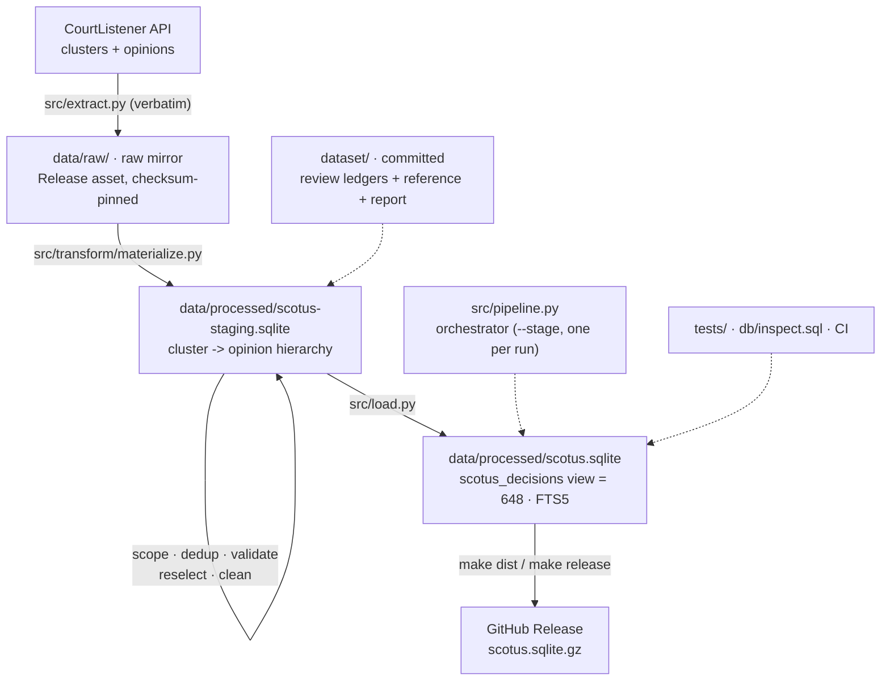

# scotus-data-bot

[](https://github.com/jcbrown-code/scotus-data-bot/actions/workflows/ci.yml)

A Python ETL pipeline that builds a clean, de-duplicated, full-text corpus of **U.S. Supreme
Court decisions in U.S. Reports volumes 2–18 (1791–1820)** from the
[CourtListener](https://www.courtlistener.com/) API and ships it as a queryable **SQLite
database**.

**648 decisions · 674 opinion texts · ~8.1M characters — reconciled case-for-case against an
authoritative per-volume reference (zero missing, zero extra).**

## Download the prebuilt database

Don't want to run the pipeline? Grab the built SQLite database from the latest
[**Release**](https://github.com/jcbrown-code/scotus-data-bot/releases/latest):

```bash
# download scotus.sqlite.gz + SHA256SUMS from the Release, then:
shasum -a 256 -c SHA256SUMS      # verify integrity
gunzip scotus.sqlite.gz
sqlite3 scotus.sqlite "SELECT count(*) FROM scotus_decisions;"   # -> 648
datasette scotus.sqlite          # or browse it in the browser
```

## The problem

A naive `docket__court=scotus` pull for this era returns **1,120 clusters** — but only 648 are
distinct Supreme Court decisions, for two main reasons:

1. **Non-SCOTUS cases.** Early *U.S. Reports* (Dallas, vols 2–4) reprinted Pennsylvania
   state-court and federal circuit cases that CourtListener tags `scotus`.
2. **Duplicate records.** CourtListener's Harvard CAP import created parallel cluster records
   for hundreds of cases it never merged, and some records carry page numbers from a different
   print edition, or even another case's SCDB id.

## Method

Extract, transform, and load are strictly separated; every stage is deterministic, and nothing
is ever deleted — records are labeled, and every exclusion carries its reason.

- **Extract** mirrors every cluster and opinion **verbatim** (all records, full API fields) into
  a raw mirror, distributed as a GitHub Release asset and pinned by committed checksums.
- **Transform** runs staged over a SQLite staging database:
  `materialize` (normalize the cluster → opinion hierarchy) → `scope` (is it a SCOTUS decision?
  reporter authority + SCDB, with a committed human-review ledger) → `dedup` (collapse duplicate
  records; scdb-anchored composite rule + a second ledger for adjudicated pairs) → `validate`
  (reconcile per volume against `dataset/case_name_reference.csv`) → `reselect` (pick the most
  faithful source text per opinion) → `clean` (derive `clean_text` and page-break offsets).
- **Load** builds the shipped database: every cluster with a terminal `corpus_status`
  (included / outside_volume / duplicate / not_scotus — the four counts sum exactly to 1,120),
  text and offset spans for the corpus opinions, FTS5, and full build lineage in `meta`.

**Validation:** the corpus reconciles **exactly** against the per-volume reference —
648 kept = 648 referenced = 648 matched, every volume 0 missing / 0 extra — and the test suite
pins that as a standing invariant. All landmarks present (Marbury, M'Culloch, Martin v. Hunter,
Dartmouth College, Fletcher).

## Repository layout



```
pyproject.toml           package metadata + [dev] extras + the scotus-pipeline entry point
config/settings.py       paths + env (token, date window, corpus span, DB paths)
src/extract.py           CourtListener API: verbatim mirror fetch (auth, pagination, pacing)
src/mirror.py            raw-mirror packaging + checksum-verified fetch (Release asset)
src/transform/           the staged Transform package:
  materialize.py           raw mirror -> staging DB (no decisions; missing = NULL)
  scope.py                 is_scotus per cluster (reporter authority + SCDB + review ledger)
  dedup.py                 duplicate records -> canonical (composite rule + review ledger)
  validate.py              per-volume reconciliation vs the committed reference
  reselect.py              choose the source-text field per opinion
  clean_opinions.py        derive clean_text + page-break offset spans
src/clean.py             the shared deterministic text cleaner
src/load.py              build the shipped scotus.sqlite from staging (separate ETL phase)
src/apparatus.py         optional reporter-apparatus asset (pending rework to V2 staging)
dataset/                 COMMITTED: review ledgers, per-volume reference, validate report
data/                    GITIGNORED: raw mirror, staging DB, the built .sqlite
db/inspect.sql           human-readable completeness report (`make inspect`)
tests/                   unit tests per stage + data-quality suites over staging and the DB
```

## Install

Runtime is stdlib-only; the package is installed editable to get the dev tools. `make setup`
creates a `.venv` and installs everything:

```bash
make setup                       # python -m venv .venv && pip install -e ".[dev]"
# or manually, in your own environment:
pip install -e ".[dev]"          # pytest + ruff + datasette
```

## Usage

Stages run **one per invocation** via `python -m src.pipeline --stage <name>` (or the
`scotus-pipeline` entry point). Only `extract` and `package-mirror` need the CourtListener
token, injected by [agentsecrets](https://github.com/The-17/agentsecrets)
(`agentsecrets env -- ...`); everything downstream is offline.

```bash
python -m src.pipeline --stage fetch-mirror   # download + verify the raw mirror (no token)
python -m src.pipeline --stage materialize    # raw mirror -> staging DB
python -m src.pipeline --stage scope          # is_scotus per cluster
python -m src.pipeline --stage dedup          # duplicate records -> canonical
python -m src.pipeline --stage validate       # reconcile vs the reference (prints the report)
python -m src.pipeline --stage reselect       # choose source text per opinion
python -m src.pipeline --stage clean          # derive clean_text + offset spans
python -m src.pipeline --stage load           # build data/processed/scotus.sqlite

make test            # unit + data-quality tests
make inspect         # human-readable completeness report
make serve           # browse/query/visualize in Datasette
make dist            # gzip the DB + SHA256SUMS (release artifact)
```

## The database

A single SQLite file (`data/processed/scotus.sqlite`) with FTS5 full-text search. Tables:
`clusters` (all 1,120, each with a terminal `corpus_status`), `citations`, `opinions` (all
1,160 rows; derived text on the 674 corpus opinions), `page_breaks` (source structure as
character-offset spans into `clean_text`), `meta`, and the views
`scotus_decisions` (the 648-decision corpus — the handoff contract for downstream analysis)
and `duplicate_clusters`. See [db/README.md](db/README.md) for the schema and example queries.

**Inspect / confirm completeness** — by eye or by SQL:
```bash
make inspect                              # provenance, the corpus_status partition, 0-textless
datasette data/processed/scotus.sqlite    # web UI: browse, full-text search, facet, export
sqlite3 data/processed/scotus.sqlite "SELECT count(*) FROM scotus_decisions"   # -> 648
```
The `tests/test_load.py` data-quality suite asserts the same facts automatically, including the
conservation contract (648 + 41 + 227 + 204 = 1,120).

## Distribution

The corpus is regenerable from `src/` + the raw mirror (a Release asset pinned by committed
checksums) + the committed `dataset/` ledgers, so the bulk data (`data/`) is gitignored. The
built database is published as a **GitHub Release asset** (`scotus.sqlite.gz`, ~5.6 MB
compressed / ~13 MB unpacked) rather than committed.

## Status

- [x] Verbatim raw mirror (Release-distributed, checksum-pinned)
- [x] Staged Transform: materialize, scope, dedup, validate, reselect, clean
- [x] Human-review ledgers (scope + dedup) and exact per-volume reference reconciliation
- [x] Load: the shipped database with terminal dispositions and offset-span structure
- [ ] OCR application (owns detection *and* evaluation; publishes only evidence-backed
      occurrence records — see docs/clean-text-design.md)
- [ ] Apparatus asset rework onto the V2 staging

## Contributing

New here? See **[CONTRIBUTING.md](CONTRIBUTING.md)** for developer onboarding — setup, the
architecture/data-flow map, the dev workflow (ruff, tests, CI), and the data-lineage
guarantees every change must keep.

## License

Code is released under the [MIT License](LICENSE). The underlying court opinions are
U.S. government works in the public domain.
